# 第5回 Asprova プログラミングコンテスト

## A - Production Scheduling Problem with Sub Resource

#### standings

standing: 14th / 56  
score: 1,789,093,724,744 

---

### submission 1

配布されているナイーブ解のソースを読む

```cpp
operations.resize(R);
for (int r = 0; r < R; ++r) {
  Order &order = orders[r];
  Operation &ope = operations[r];
  Bom &bom = boms[order.i];
  ope.r = r;
  ope.i = order.i;
  ope.main_m = bom.main_resources.m_to_c.begin()->first; // ここ
  for (int s = 0; s < bom.ss; ++s) {
    int ms = bom.s_to_sub_resources[s].ms_list[0]; // ここ
    ope.sub_ms_list.push_back(ms);
  }
}
```

資源選択に幅がないので、ある役割を一つの資源に丸投げするコードになっている

都度ランダムに資源選択することで、役割の分担を図る

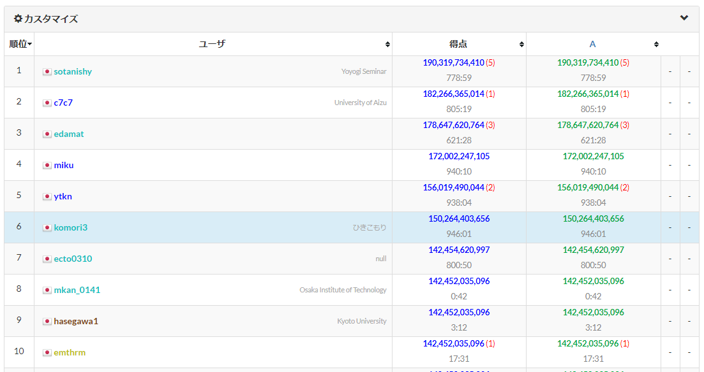

団子は抜けることができた

-49,735,596,344(6)

---

### submission 2

ローカルでスコア計算ができれば、多点スタート乱択ができる

これは output_checker を真似すればいい

-49,735,596,344(6) -> ‭-41,421,116,973‬(5)

---

### submission 3

資源割り当てを greedy にしてみる　

つまり、各役割について、利用可能になる時刻が最も早い資源を選択する

practice05 などでは劇的な効果がある

‭-41,421,116,973‬(5) -> -29,286,230,839(5)

---

### submission 4

スコアが下がるケースもあるので、乱択とのいいとこ取りをする

乱択がどの程度有効かチェックする意図もある

-29,286,230,839(5) -> ‭-28,847,867,043‬(5)

微妙

---

### submission 5

乱択の前に本質的に改善できる部分があるはず

たとえば今はオーダーが最早開始時刻の早い順で処理されているが、ここを 2 point swap すれば山登りができる

昔のコンテストでも常套手段だったので、やればある程度は上がるだろう

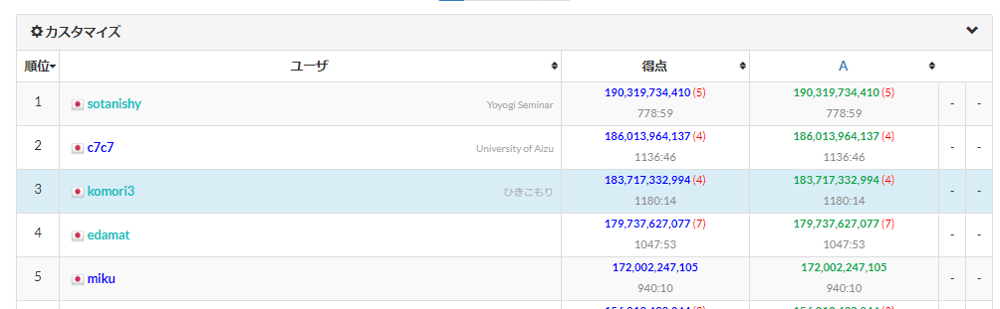

‭-28,847,867,043‬(5) -> ‭-16,282,667,006‬(3)

走り出しはまずまず

---

### submission 6

時間を 50 倍にしても収束しない　2 point swap が筋悪なのと、未高速化なのが大きそう

近傍マシにして高速化したら 1 位くらいの点出るかな？

```cpp
vector<Order> orders;
vector<Bom> boms;
vector<map<pii, int>> setup_times; // これ 3d array でええやろ
```

とりあえず色々ネックになってそうな部分を高速化　五倍くらい？

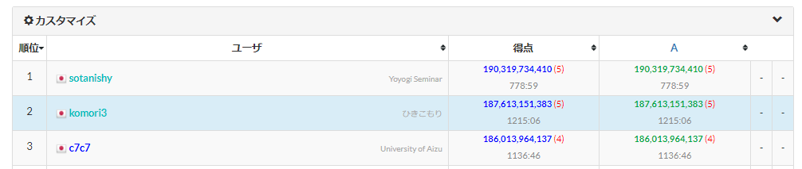

-16,282,667,006‬(3) -> -12,386,848,617(2)

いいね　次は近傍考えるか

---

### submission 7

近傍を 2 swap じゃなくて reverse にする -> あんまよくない

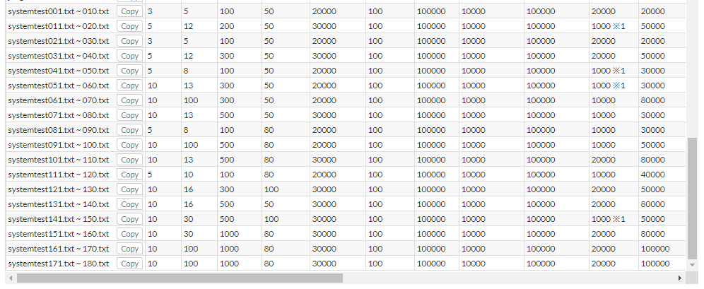

最終的にテストケースに対して最適なソルバーを選ぶ機構を作ることになると思うので、アイデアは全部メモってソルバは簡単なものは全部作っておくのが望ましい？

ローカルテスト環境も整備したいところではあるが、めんどくさくて着手できてない…

テストケースごとの点が今回は見れるっぽいが、judge20 だけ 1e9 点くらい上がっていることは留意しておく

---

### submission 8

sub. 6 を時間いっぱい回す (1900ms -> 1985ms)

-12,386,848,617(2) -> -12,347,865,913(2)

---

### submission 9

例によって高速化 & 差分更新からの焼きなましゲーなんだろうか？

sub. 8 の点を見るに幾つかのケースでは頭打ちになってるので、焼きなまして変化を見てみよう

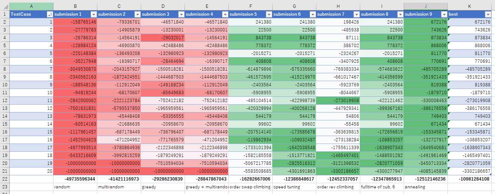

全体は下がっているが頭打ちだったものについては上がっている

---

### submission 10-12

色々な遷移を試した

* swap: 2 つのオーダの割り当て順交換
* rev: オーダ割り当て順の特定区間を反転させる
* slide: あるオーダを別の場所にスライドさせる

どれもめぼしい成果なし

---

ビジュアライザを眺めると、段取りが支配的でありそう

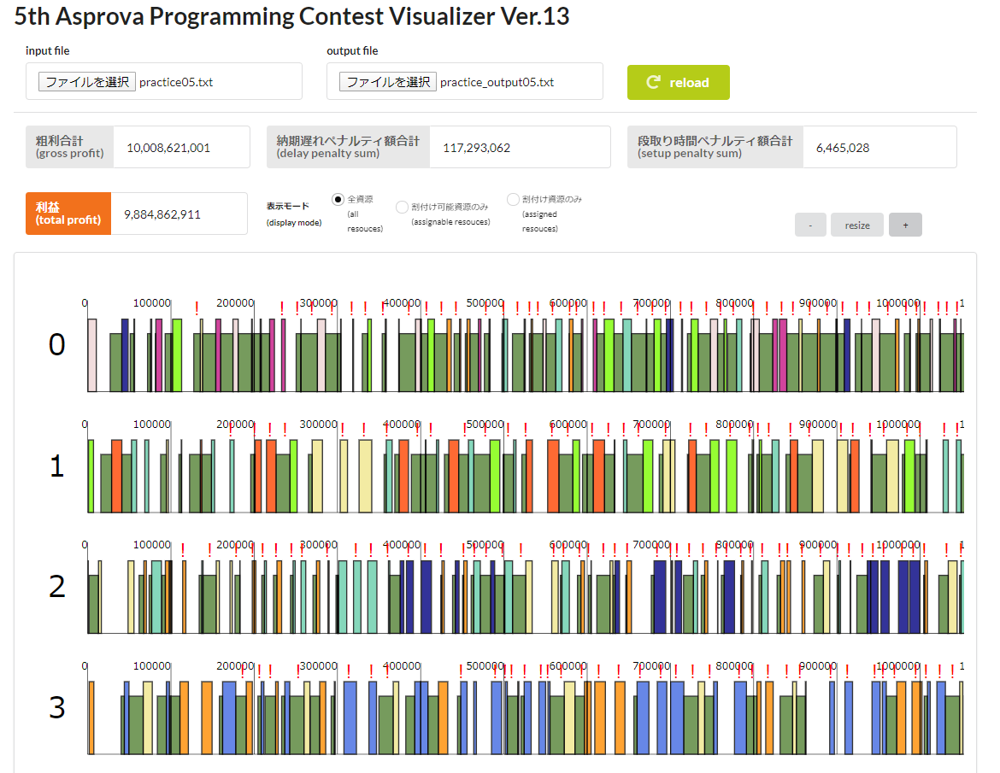

ケツの方の依頼は全部納期遅れが発生している

段取りが少ないほど高スコアを与えるようにすると、全体の終了時刻が早まって納期遅れが軽減されるのではないか？

前の懇親会で誰かが、同品目の依頼が連続する場合にボーナスを与えていた気がする

prev_t3 と now_t2 の間に時間が空くことに対してペナルティを課して、ビームサーチ？

---

greedy 割り当てを適当にしか検証していない

メインマシン選択のときに"最も空く時間が早い"マシンを選択しているが、これだと生産能力の低いマシンにも割り当てられてしまう

そこで、"最も依頼遂行時間が短い"マシンを選択するように変更してみる

---

### submission 13-15

まあまあよくなってきたけどスコアあんま覚えてない

---

### submission 16

ローカルテスト環境を整備

とりあえずシステスと同条件の 180 ケースを生成して各 submission を比較、topcoder 形式でスコア計算する各種スクリプトを書いた

みんなが 1.9e11 を超えてきているので見落としを探す

段取り時間が支配的なので、最初にオーダを割り付ける順番を決める際に、(item num, earliest start time) の順にソートする

同品目が連続で並ぶので、そこでの段取りは発生しないはず

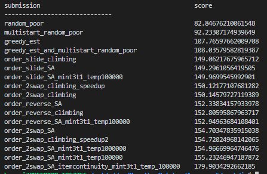

一番下がそれ　読みが当たったぽい

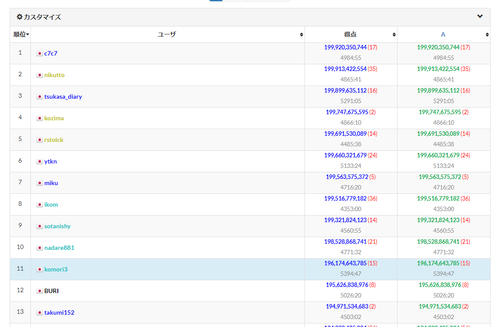

お年玉狙ってこうな

---

### submission 17

前段階として、同品目オーダを一纏めにしたブロック単位でオーダ列を入れ替えて山登りすればいい感じになるんじゃない？

多分 2swap よりでかいオーダで点数改善しそうだし（オーダが紛らわしい）

ブロック単位で山登りしたあと、オーダ単位でスワップ焼きなまし

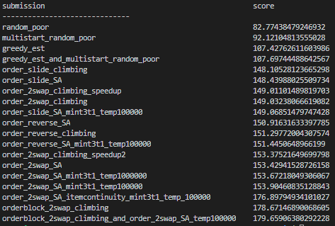

伸びてる伸びてる

ただし、ギチギチに詰まっているせいかオーダ単位の焼きなましパートで遷移しない問題がある

品目ごとにブロックを形成して一気に割り付けると単品目が広範な時間に渡ってしまう

適切なブロックサイズに分割することが重要？

そのような遷移を一定確率で混ぜて焼きなましすると良さそう

---

### submission 18

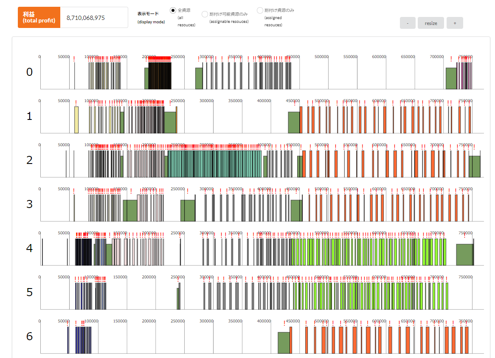

その前にビジュアライザを眺めて気づいたけどスッカスカになってる

ブロック単位で割り付けると言っておいて、割り付け時に最も早くフリーになる設備をオーダ一つ一つに対して選定して割り付けているので、分散されてブロックにした意味がなくなっている

ちゃんとブロック単位でオーダを割り付けるよう実装しよう

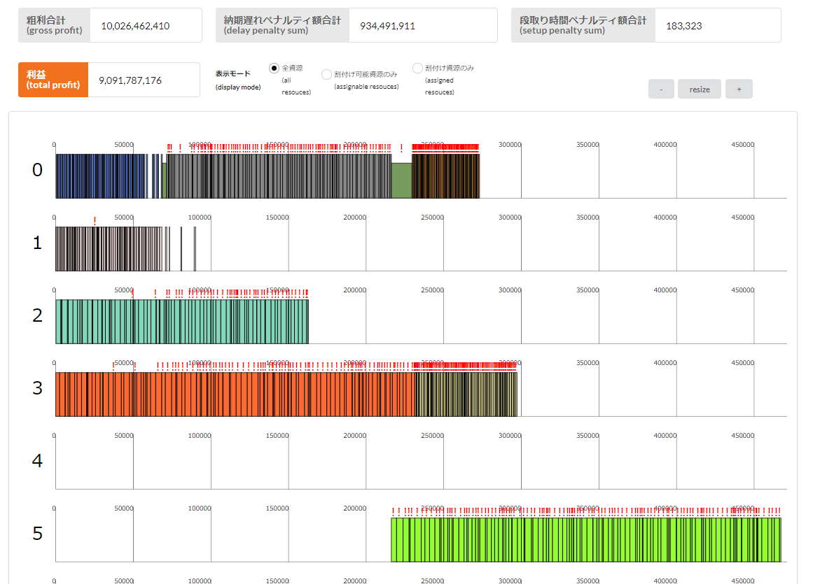

ギッチリ詰まっとる

品目の順番変更しないで投げて -4,254,224,324 点　これはハイスコアに迫る得点

この方針が正解っぽいなー

---

### submission 19

品目の順番変更する山登りで -1,146,068,799 点　ハイスコア更新して 10 位

あとは同品目のオーダを複数のブロックに分割したり同品目内の 2 オーダをスワップしたりする遷移を入れるとよさそう

---

...

---

「[人類が増えすぎたので減らしてほしいと頼まれました　　【本編完結済】](https://ncode.syosetu.com/n0859fa/)」を読んでたら残り三日あったはずなのにコンテストが終わっていた


組合せ爆発って知ってる？

---

結局 provisional は 20 位、final は 14 位だった

systest と同じ条件でローカルテストしていたのが功を奏したっぽい