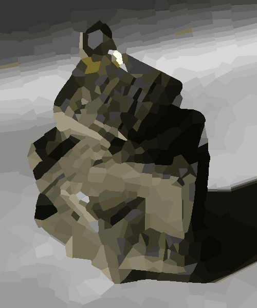

# MM106: StainedGlass

standing: 7th / 52 (provisional: 8th)  
score: 871,080.00 (provisional: 865,600.00)  
rating: 1814 -> 1906 (+92, highest)

## 概要

* ステンドグラスを作りなさ～い

## やったこと

* ハニカム状に母点を配置して波面法っぽい何かを使う

* 母点の近傍移動による焼きなまし (30 itr に一回差分最小のセルを削除して差分最大のセルの周辺に挿入)

* kmeans++ で色空間をクラスタリングして減色 (2 ~ 70 色で全探索)

* 偏差絶対値和は中央値で最小化される

## 結果

seed 1:  

seed 2:  

seed 3:  

seed 4:  

seed 5:  

seed 6:  

seed 7:  

seed 8:  

seed 9:  

seed 10:  
