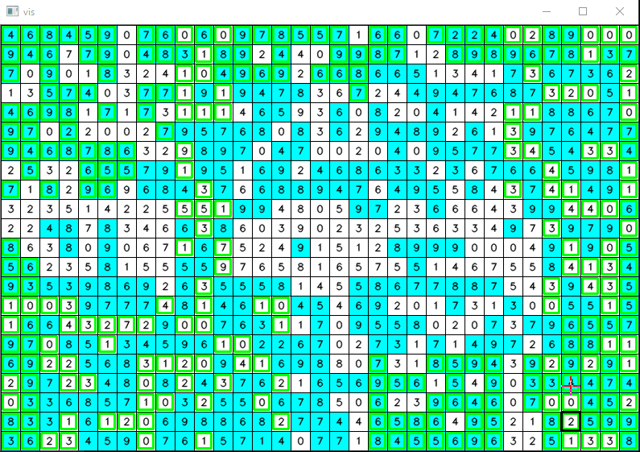

# MM107: PointsOnGrid

お前絶対フルサブに 2 ケースくらい変なやつ入れただろ

provisional standing: 31st / 106  
provisional score: 993699.79  

## 概要

* [グリッドを塗りつぶしなさ～い](https://community.topcoder.com/longcontest/?module=ViewProblemStatement&rd=17405&pm=15265)

## やったこと

* valid な初期状態の構成

H = W = 10, h = 3, w = 4, Kmin = 3, Kmax = 5 で考える

```
    0 1 2 3| 4 5 6 7| 8 9
  +--------+--------+----
0 | 0 1 2 3| 0 1 2 3| 0 1
1 | 4 5 6 7| 4 5 6 7| 4 5
2 | 8 9 a b| 8 9 a b| 8 9
--+--------+--------+----
3 | 0 1 2 3| 0 1 2 3| 0 1
4 | 4 5 6 7| 4 5 6 7| 4 5
5 | 8 9 a b| 8 9 a b| 8 9
--+--------+--------+----
6 | 0 1 2 3| 0 1 2 3| 0 1
7 | 4 5 6 7| 4 5 6 7| 4 5
8 | 8 9 a b| 8 9 a b| 8 9
--+--------+--------+----
9 | 0 1 2 3| 0 1 2 3| 0 1
```

盤面を h * w に区切って (i % h, j % w) が等しいものでグループ分けする (上図の 0 ~ b)

0 ~ b の中から K (Kmin <= K <= Kmax) 個選んで塗りつぶすと任意の h * w の矩形上における塗られたマスを K 個にできる

グループ g に属するセルの総和を S(g) としたとき，S(g) の大きい順に Kmin グループ塗りつぶして initState を構成

<br/>

* 順列 swap による山登り (<= 7.7 sec)


```cpp
bestState = initState;
state = initState;

// unpainted なマス (i, j) のリストを board[i][j] の降順で取得
v = initState.getUnpaintedList();

// v を先頭から見ていって塗りつぶせる場所があれば塗りつぶす
state.paintList(v);

bestState = state;

n = v.size();
r1 = -1, r2 = -1;
do {
    while (true) {
        prev_score = state.score;

        // painted なマス (i, j) のリストを board[i][j] の昇順で取得
        v2 = state.getPaintedList();
        for (i, j) in v2 {
            if (!state.erasable(i, j)) continue;
            // 移動可能なら最もスコア上昇の大きいマスへ (i, j) を移動
            state.bestMove(i, j);
        }

        if (prev_score == state.score) break;
    }

    if (state.score >= bestState.score) {
        bestState = state;
    }
    else if (r1 >= 0) {
        // 改善しなければ swap して元に戻す
        swap(v[r1], v[r2]);
    }

    r1 = rnd.nextInt(n);
    do { r2 = rnd.nextInt(n); } while (r1 == r2);

    // 順列 swap
    swap(v[r1], v[r2]);

    state = initState;
    state.paintList(v);

} while (time < 7.7);
```

<br/>

* 焼きなまし (<= 9.7 sec)
  * 4 方向へのスライド (99%)
  * 最もスコア上昇の大きいマスへの移動 (1%)
  * 100000 回ごとに盤上の塗りつぶしマスの総数を増減させる (なんとなくスコアがでかくなるように)


## 呪詛

手元では前半の swap フェーズを減らして焼きなましの時間を増やすほどスコアが上がるが full submit すると何故か 970k になる

何回やっても swap フェーズを 7.7 秒以外にすると 970k になる

何


## おまけ

遊べるやつ(お家芸)



