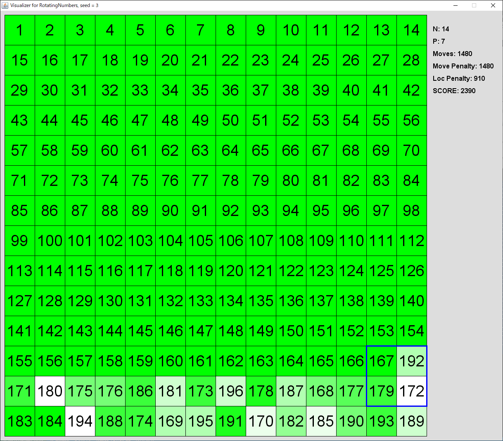
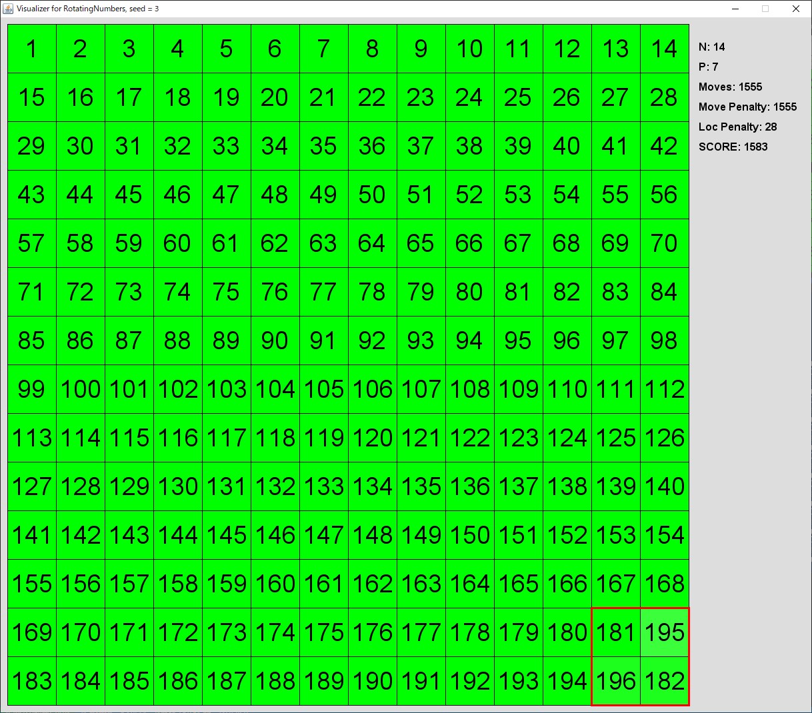
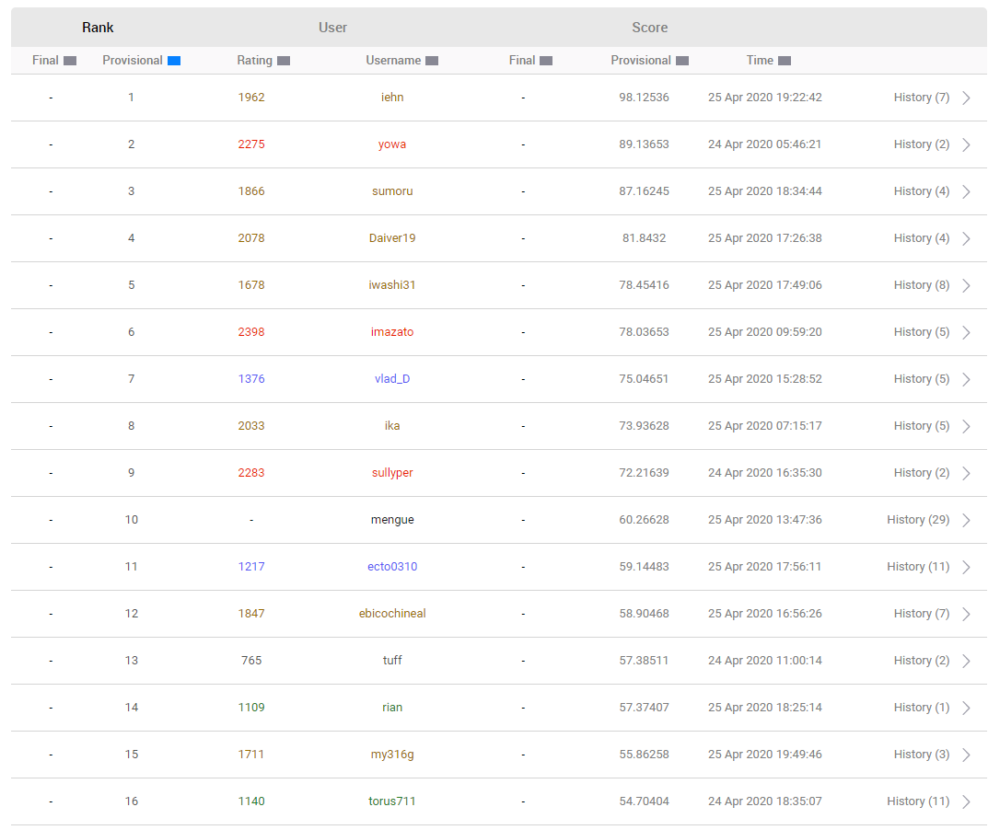
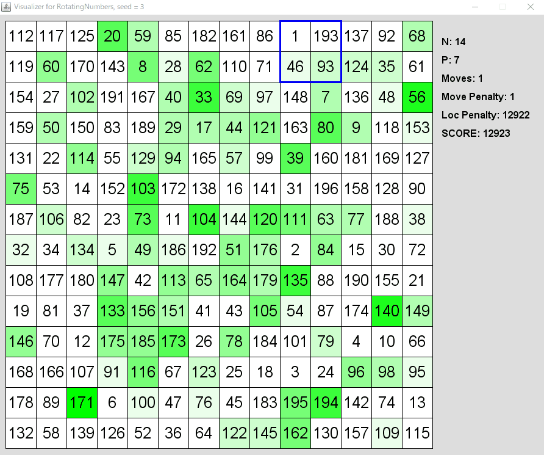
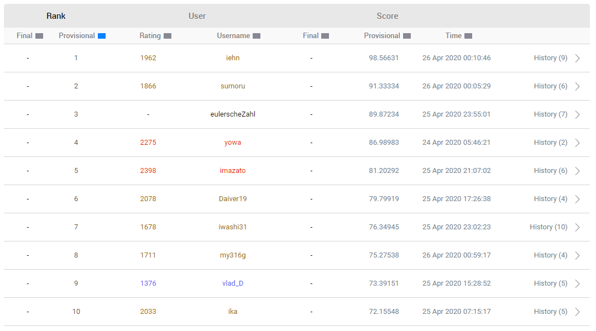
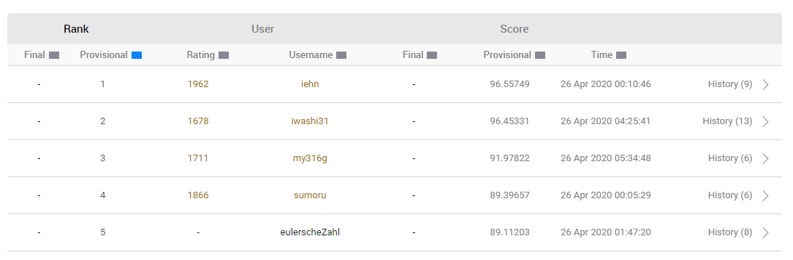
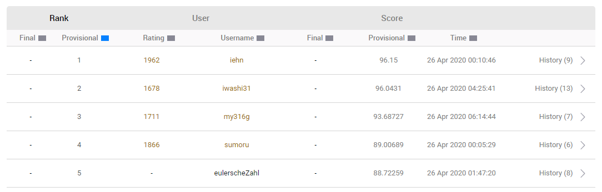
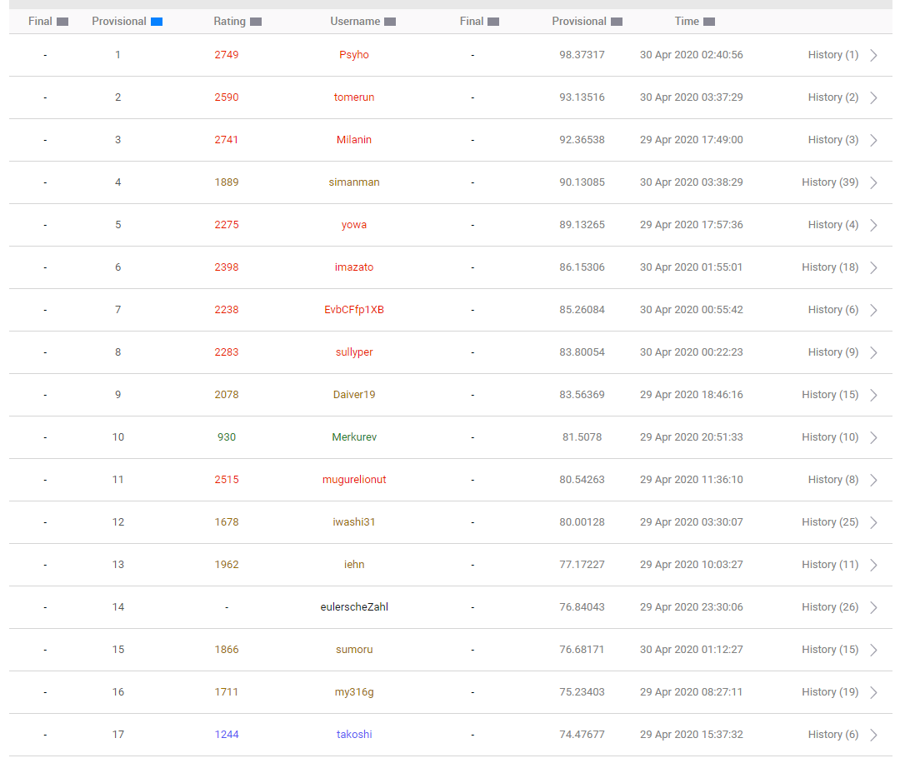

# MM117: RotatingNumbers

#### provisional  

## 概要

* まわしてそろえる

## 垂れ流し

---

四苦八苦しながらスコア計算と回転遷移を実装

1 手で到達できる全ての状態のうち、最もスコアを改善するような遷移を選び続ける貪欲を書く  
途中で移動コストの影響が大きくなる場合は打ち切って最もスコアの良いものを出力

local submission name は bruteforce とでもする

```
submission    score
--------------------------------------------------
trivial       47.647913165147166
bruteforce    100.0
```

trivial はサンプルそのまんま投げたやつ

そもそもターン制で一手しか読まないのは悪手だし、全探索が重すぎて N の大きいケースでは話にならない

---

盤面を完成させることを考える

2x2 で埋められるところまで埋める



ここまではベタ書きでなんとかなる（たまにバグるけど、まあ誤差でしょ）

```
submission    score
--------------------------------------------------
trivial       32.197536239240215
bruteforce    68.23635074068005
align_byline  95.45960150364202
```

自明の三倍くらいになったので、様子見で submit してみる

たぶんトップは 10 倍くらい出してそうな気がするけど…


思ったより希望はあるかな、という感じ

---

盤面サイズ N におけるマンハッタン距離の総和の期待値が知りたい

適当にシミュレーションして OEIS にぶん投げると

```
f(n) = 2*n*(n+1)*(n+2)/3
```

であることがわかる

---

ところでこの問題、Number Rotation Puzzle (NRP) と呼ばれていて<a href="https://www.researchgate.net/publication/283582683_BBFS-STT_An_efficient_algorithm_for_number_rotation_puzzle">論文</a>とかもあるっぽい

あと、煮え湯を飲まされた <a href="https://atcoder.jp/contests/rco-contest-2019-final/tasks/rco_contest_2019_final_b">第3回 RCO日本橋ハーフマラソン 本戦 B - まわしてそろえる</a> に似ているんですよね　トップの解法が大いに参考になりそう

---

すぐ実装できそうなのは、「未完領域が正方形を保つように正しい位置に運んでいく」やつ

* 後半のほうの移動距離の期待値が小さくなる（ほんまか？）
* 列で揃える場合に最後の 2 列が死んでいたのに対し、正方形型なら 2x2 に抑えられる

実装した



```
submission        score
--------------------------------------------------
trivial           25.744513281706514
bruteforce        52.924591459109514
align_byline      72.68055816604151
align_bysquare    97.68202652152718
```

よさそうなので提出する



スタートラインに立った感じ  
あと 2 倍近く改善しないと上位に行けない　気が遠くなるな

---

今までは 2x2 しか使っていなかった

「あるセルをある位置まで運ぶ」一連の処理をビームサーチっぽく実装したい

まずは評価は生スコアでいいだろう



```
submission           score
--------------------------------------------------
trivial              18.5105308444875
bruteforce           38.024862043217105
align_byline         49.31263817292291
align_bysquare       67.5534557935947
align_with_search    98.9763103147393
```

実装が終わった　なかなかいい感じじゃない？

高速化をしていないのでビーム幅 2 以上にすると死ぬので実質貪欲（というか example test Seed 2 で TLE してる）



ブチ上がって来た

しばらくは高速化パートかな

---

* 生の構造体で priority_queue はアホ遅い -> shared_ptr にする
* shared_ptr だろうが何だろうがインスタンス生成はできるだけしないほうがいい
  * Double-ended priority queue を使うことで低スコアのインスタンスを生成しないようにする

これで多分幅 5 くらいなら何とか間に合うようになったはず

```
submission                   score
--------------------------------------------------
trivial                      17.374220442408944
bruteforce                   35.612859404434495
align_byline                 46.00557774903941
align_bysquare               62.68509853798838
align_with_search            92.11170405404806
align_with_search_speedup    99.45021247785836
```

のびてるね

seed 2 がローカルで 4sec で終わるのに topcoder 側で 12sec かかって TLE する　なんでや

とりあえず幅を 5 -> 3 に減らして様子見かなあ



いや　変な笑い出たけど

これ多分 N の値でビーム幅調整したらまだ伸びる余地あるよね

```cpp
static int bws[41] = {
  0,
  0,0,0,500,500,500,500,500,500,500,
  200,200,200,200,200,100,100,100,100,100,
  80,70,60,50,40,30,20,15,13,11,
  9,8,7,6,5,5,4,4,3,3
};
```

雑な調整を入れた

```
submission                              score
--------------------------------------------------
trivial                                 17.06545089304469
bruteforce                              34.917600510457646
align_byline                            45.143959413750004
align_bysquare                          61.53936562547277
align_with_search                       90.38507637759209
align_with_search_speedup               97.61698083003051
align_with_search_beamwidth_adjusted    98.35523018570221
```

ちょい伸び



top が見えてきたか？

---

こういう問題は小さいケースがかなり大事だったりする

N=40 の 20000 -> 18000 より N=4 の 50 -> 25 の方が効果絶大なので

ということで、残り 4x4 の盤面になったときに、なんちゃって A* 探索っぽく解くソルバを作った

seed 1 なんかは score=12 が出ている

（ここで解法出涸らしになったので、ふて寝して最終日終了 5 時間前までジャンプ）

---

```
submission                              score
--------------------------------------------------
trivial                                 14.236888859983813
bruteforce                              29.038951285083854
align_byline                            38.991471122203244
align_bysquare                          51.88160408429924
align_with_search                       78.55008042948145
align_with_search_speedup               84.80490447648157
align_with_search_beamwidth_adjusted    85.57884802685292
align_with_search_4x4_pseudo_astar      94.4382057764668
pseudo_astar_non_tle                    95.59923574612914
align_double                            96.47878093401009
align_refine                            96.63825827435525
align_modify_scoring                    97.54317285961409
align_modify_scoring2                   99.07173842591936
```

ローカル提出の最終日の状態


align_with_search_4x4_pseudo_astar で 10 点くらい上がった

TLE に気をつけるようにしたのが pseudo_astar_non_tle

align_double は 2 個同時に運搬していくような実装だが、難しすぎてまともに書ける気がせず途中で断念

align_refine は隅のほうの揃え方を微妙に改善したやつ

align_modify_scoring は「どうせ全マス揃うなら P なんでもよくね？」ということで、P に独自の係数を設定したもの　P=0.4 くらいが一番よかったので採用



ここまで落ちるとはなぁ……

Psyho 氏が強いヤバいとは聞いてたけど、強すぎて爆笑しています