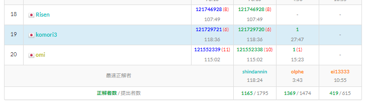
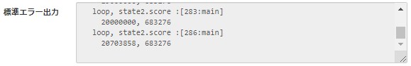
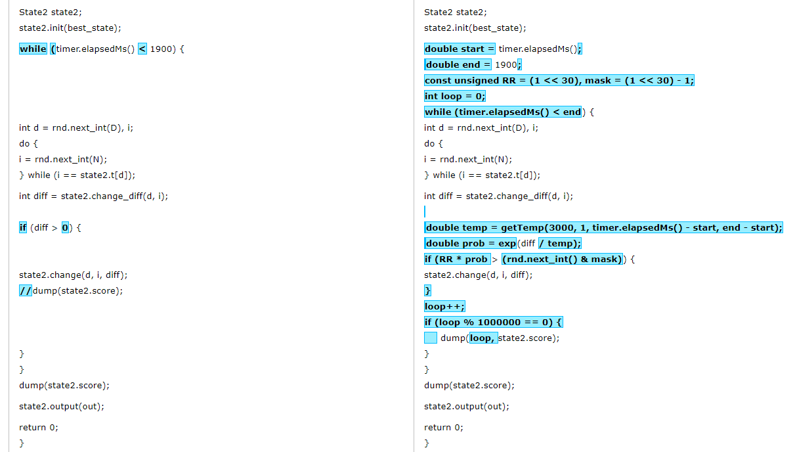
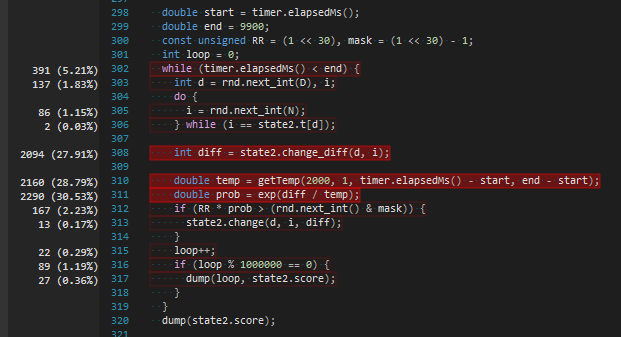
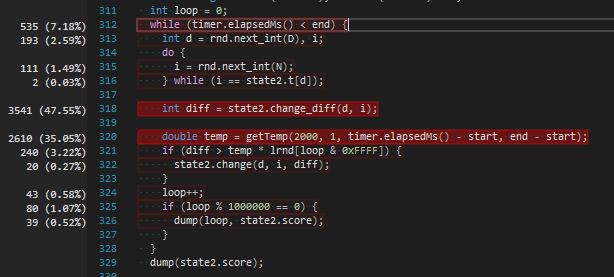
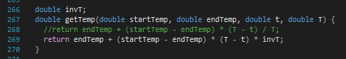
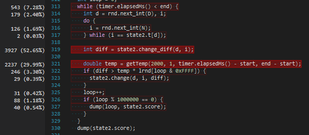

# Introduction to Heuristics Contest

<a href="https://atcoder.jp/contests/intro-heuristics">contest page</a>  
standing: 19th / 1765  
score: 121729721



## やったこと

### 21:00 ~ 21:05

入力生成器があるので、ダウンロードして seed 1 の入力だけ生成  
以下のような形で入力をスイッチできるようにした

```cpp
int main() {
  ios::sync_with_stdio(false);
  cin.tie(0);

  /* テキスト入出力 */
  //ifstream ifs("path_to_input.txt");
  //istream& in = ifs;
  //ofstream ofs("path_to_output.txt");
  //ostream& out = ofs;

  /* 標準入出力 */
  istream& in = cin;
  ostream& out = cout;

  // 実装

  return 0;
}
```

### 21:05 ~ 21:20

問題 B にもあるように、セオリー通りにスコア計算関数を書く  
→ 何故かテスターの吐くスコアと合わなくて雲行きが怪しくなってくる

テスターあるし読めばいいじゃんと思ったが、python なので読解コストの方が高そう  
→ 問題 B を見る


### 21:27

問題 B を解いた → <a href="https://atcoder.jp/contests/intro-heuristics/submissions/14809996">提出</a>

スコアが合わなかった原因として、満足度低下の計算が毎日行われるのを見落としていた

つまり、コンテスト i が d 日ぶりに開催されたときに <code>c[i] * d</code> を減算していたが、本当は <code>c[i] * (1+...+(d-1))</code> を減算するべきだった

短時間コンテストの恐ろしい性質として誤読をしたまま一生無をやって終わってしまうというのがあり、そうならなくて本当によかった（問題文をよく読めや）

### 21:40

スコアが合致したので、さっと貪欲を書いて投げた → <a href="https://atcoder.jp/contests/intro-heuristics/submissions/14811656">提出</a> (62634806)

N = 26, D = 365 として、d 日目にコンテスト i を開催したときのスコア変化分計算が O(N) で、各コンテスト・各日について調べるので全体で O(N^2 D)

### 22:24

貪欲が書けたら山を登りましょう → <a href="https://atcoder.jp/contests/intro-heuristics/submissions/14817342">提出</a> (107365186)

<br/>

一日目から順に埋めていくビームサーチも考えなくはなかったが、少し考えて焼きなましに落ちそうだったのと、焼ける時は焼いてしまった方が経験上いいというのがあったので、山登り → 焼きなましルートで固める（ビームサーチ、実装だるいし…）

<br/>

State 構造体内で O(N^2 D) で貪欲解を求めたが、山登りは高速化が肝要なので別の構造体 State2 をつくって、異なるデータ構造をとらせている

<br/>

具体的には、

* d 日目に開催されるコンテストを保持する配列: <code>t</code>
* コンテスト i が開催された日付を保持する set: <code>contest_to_days[i]</code>
* 現在のスコア: <code>score</code>

の三つ

<br/>

遷移は

* d 日目に開催されるコンテストを pi → i に変更する

の一種類のみ

<br/>

d 日目のコンテスト pi を i に変更したときのスコア差分は、

* d 日目のコンテストを"削除"したときの差分 <code>erase_diff(d)</code>
* d 日目にコンテスト i を"挿入"したときの差分 <code>insert_diff(d, i)</code>

の和で求まり、どちらもだいたい O(log(D/N)) くらいで計算できる

<br/>

ループ回数は atcoder のコードテストで 20M くらいになった



### 22:33

山が登れたら焼きましょう → <a href="https://atcoder.jp/contests/intro-heuristics/submissions/14818485">提出</a> (119794413)

山を焼くフェーズ、コード変更する部分がごく僅かで絶大な効果が得られるのでかなり好き



差分はこれと、時間経過に対して温度を線形に下げる温度計算関数 <code>getTemp()</code> しかない

ループ回数は 14M くらい（減ったのは多分遷移 accept 率の上昇と、exp 関数等の影響）

### 22:33 ~ 22:47

高速化コードを書きつつ、裏で温度を 3000 → 2000 → 1000 と変えて submit チューニングをしていた

2000 の時が<a href="https://atcoder.jp/contests/intro-heuristics/submissions/14819517">一番良かった (120648504)</a> ので、以降それを採用

### 22:53

高速化その 1 → <a href="https://atcoder.jp/contests/intro-heuristics/submissions/14821244">提出</a> (121227283)

具体的には、コンテスト i の開催日付を set で管理していたものを配列に変更しただけ

経験的に要素が数個 ~ 十数個のときは、insert, erase で O(n) かかっても配列にした方が定数倍で速くなる、という印象があったので、プロファイラ等確認しつつ実装した

ループ回数は 23M くらいに伸びた

### 22:58

高速化その 2 (最終提出) → <a href="https://atcoder.jp/contests/intro-heuristics/submissions/14822099">提出</a> (121729720)



焼きなまし部のプロファイリング結果を見ると、差分計算には 3 割しか掛かっておらず、温度計算と exp 関数で 6 割近く（！）消費されていることがわかる

exp 計算の部分について、RR とか mask とかがあって紛らわしいが、やっていることはスコア差分 ⊿、温度 T、乱数 r として

exp(⊿/T) > r

を判定しているだけで、これを変形すると

⊿ > T ln r

になる

予め配列 lrnd に十分な数の(今回は 65536 個) ln r の値を保持しておいて、lrnd[numloop & 65535] の値を乱数生成された ln r の値とみなすことで exp, log 等の関数なしで温度条件判定するテクがある



これをすると条件判定部が (30.53 + 2.23)% → 3.22% に大幅改善する

ループ回数は大体 33M くらいに伸びた

<br/>

残る目立つ部分は <code>getTemp()</code> の部分



上のように、逆数 invT を前計算しておくことで、除算を乗算に変える悪足掻きをした



これにより温度計算部が 7% くらい削減できて、最終的なループ回数は 35M くらいになった

（時間計測を 256 回に 1 回とかにすると 14% くらい削減できそうだったが、あえなく時間切れ）

---

結果はめでたく 1 ページ目に滑り込めて、ガッツポーズをして終了